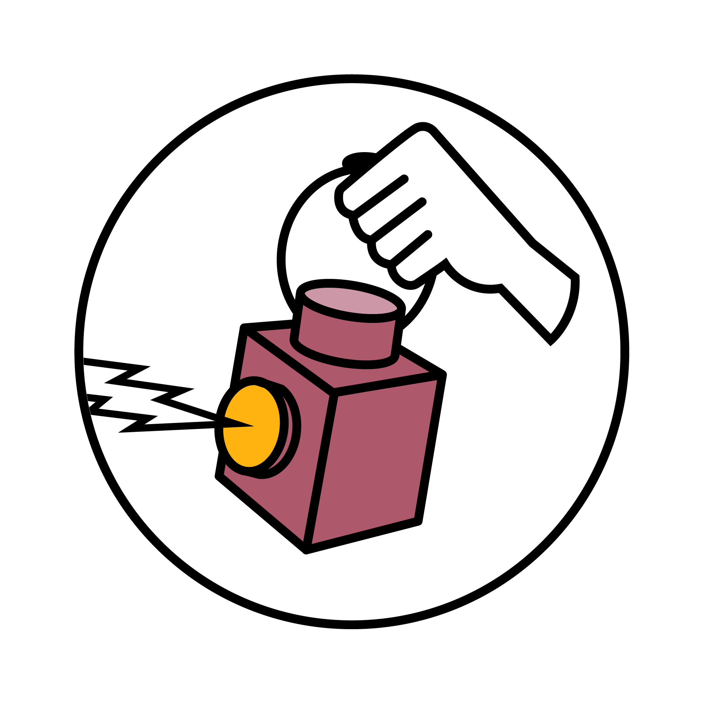

# **RATING-OPERATOR**

## Overview

`rating-operator` is a Kubernetes native application that generate customizable **K**ey **P**erformance **I**ndicator as metrics and provide interfaces to exploit them. It features a multi-tenant, configurable and light operator to help users solve their rating needs.

## Table of content

- [Configuration](/documentation/CONFIGURE.md)
- [Installation](/documentation/INSTALL.md)
- [Usage](/documentation/USAGE.md)
- [Custom Resources](/documentation/CRD.md)
- [Advanced Features](/documentation/FEATURES.md)
- [Architecture](/documentation/ARCHITECTURE.md)
- [API endpoints](/documentation/API.md)
- [Troubleshooting](/documentation/TROUBLESHOOT.md)
- [Contributing](documentation/CONTRIBUTING.md)

## **Credits**

Kudos to the people behind:

- `metering-operator` from **CoreOS** (**Deprecated**)
- `kopf` from **Zalando**
- `operator-sdk` from **Red hat**

for their great tools that helped us build this solution.
Made with **<3** by the **R&D team @ [`Alterway`](https://www.alterway.fr/)**
