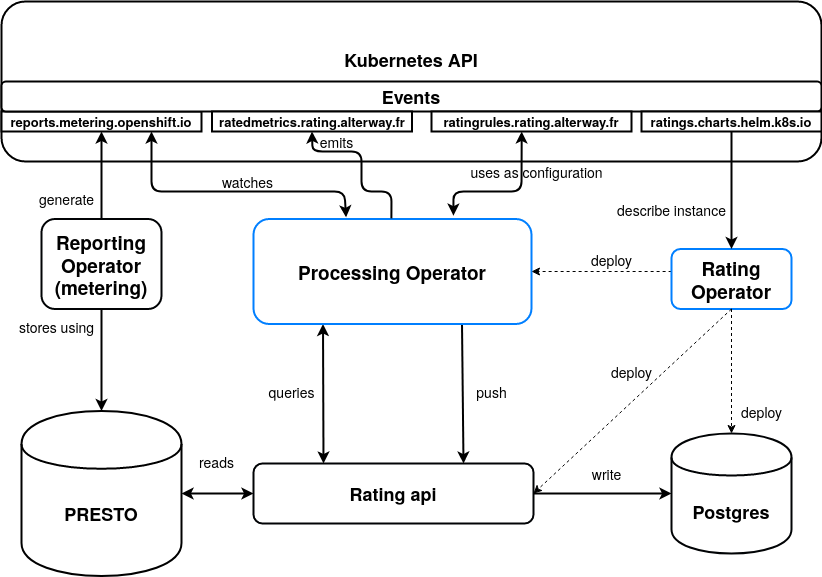

# **rating-operator**

The `rating-operator` is the main repository for the `rating stack`.

In it, you can expect to find all the necessary tools, scripts or documentations to help you achieve your rating needs.


## **Dependencies**

### Metering-operator

For now, the `processing-operator` depends on the `metering-operator` capability to generate `reports`, those being at the core of our system.

The installation and configuration of the metering-operator is covered in the **quickstart** section.


## **Components**

### Rating-operator

This is the core handler for the application. It helps with deploying your instances, update versions dynamically, by watching its CustomResource.

#### *Custom Resource* : *ratings.charts.helm.k8s.io*

This CR basically contains a description of your rating instance (equivalent to the `values.yaml` of helm).
If you need to connect to a particular Presto database, or use a particular version of our components, this is the place to go.

The operator will react to any change and modify the structure accordingly.
A base chart can be found in `./deploy/crds/charts.helm.k8s.io_v1alpha1_rating_cr.yaml`

For each `ratings.charts.helm.k8s.io`, the operator will install 3 additional components


### Rating-api

This component is used for internal communication, as well as a way to extract rated data for further uses.

The api endpoints for users are better described in the `rating-api` [documentation](https://git.rnd.alterway.fr/overboard/5gbiller/rating-api/-/blob/master/README.md).

It will help the `processing-operator` acquire its configuration through a CustomResource.

#### *Custom Resource* : *ratingrules.rating.alterway.fr*

This CR holds the configuration that the `processing-operator` will use to rate the dataframes.
When creating a new configuration, a timestamp will be attributed to it.
This timestamp represents the start of its validity period. The validity expires as soon as a new configuration is created.

It enables us to keep the valid configuration for a given period of time, to be able to modify it, and if needed, re-trigger the frame calculation with the updated rules by removing the associated `RatedMetrics`.

The content of this CR is better described in the dedicated part of `processing-operator` [documentation](https://git.rnd.alterway.fr/overboard/5gbiller/processing-operator/-/blob/master/README.md).


### Processing-operator

This reprensents the functional and reactive core of the operator, being itself an operator.
It is built using [kopf](https://github.com/zalando-incubator/kopf), to benefit from its asynchronous event binding system and ease of use.
The `processing-operator` watches the `reports` events, and matches those with the configuration it received from the `rating-api`. Once a match is made, it triggers the rating, then pushes rated data to postgres via the `rating-api` and generates or updates its own CustomResource.

#### *Custom Resource*

##### *ratedmetrics.rating.alterway.fr*

Every time a rated metric comes out of our system, the operator updates a `RatedMetric` object, allowing others to be notified of newly rated data.
Internal description and interaction with this CR is better described in the dedicated part of `processing-operator` [documentation](https://git.rnd.alterway.fr/overboard/5gbiller/processing-operator/-/blob/master/README.md).


### rating-postgresql

The rated data is stored in a postgresql database.
In case you need to access the database, you can use the `./hack/psql`.

## **Architecture**

This schema sums up the components and their interactions described above.




## **Installation**

To install the `rating`, you need to install its dependencies into your cluster.
To do so, we added instructions in the [quickstart](https://git.rnd.alterway.fr/overboard/5gbiller/rating-operator/-/blob/vdaviot-v1.0.0/quickstart/INSTALL.adoc) folder.
It also contains convenience scripts to help you setup and handle everything.

Once deployed, the operator generally takes minutes to be fully operationnal.
You should then see something like:

```sh
> kubectl get all -n rating
NAME                                     READY   STATUS    RESTARTS   AGE
pod/rating-api-69d7b5d849-25gms          1/1     Running   0          7d3h
pod/rating-operator-776dc658cc-9k9xg     1/1     Running   0          7d3h
pod/rating-postgresql-0                  1/1     Running   0          7d3h
pod/rating-processing-796b648886-hzxql   1/1     Running   1          7d3h

NAME                                 TYPE        CLUSTER-IP       EXTERNAL-IP   PORT(S)             AGE
service/rating-api                   ClusterIP   10.152.183.81    <none>        80/TCP              7d3h
service/rating-operator-metrics      ClusterIP   10.152.183.125   <none>        8383/TCP,8686/TCP   7d3h
service/rating-postgresql            ClusterIP   10.152.183.41    <none>        5432/TCP            7d3h
service/rating-postgresql-headless   ClusterIP   None             <none>        5432/TCP            7d3h

NAME                                READY   UP-TO-DATE   AVAILABLE   AGE
deployment.apps/rating-api          1/1     1            1           7d3h
deployment.apps/rating-operator     1/1     1            1           7d3h
deployment.apps/rating-processing   1/1     1            1           7d3h

NAME                                           DESIRED   CURRENT   READY   AGE
replicaset.apps/rating-api-69d7b5d849          1         1         1       7d3h
replicaset.apps/rating-operator-776dc658cc     1         1         1       7d3h
replicaset.apps/rating-processing-796b648886   1         1         1       7d3h

NAME                                 READY   AGE
statefulset.apps/rating-postgresql   1/1     7d3h
```


## **Usage**

With the deployment, a basic configuartion compatible with the base installation of the `metering-operator` will be used.
You might want to create a new one to fit your use case. Follow the pattern described in [ratingrules](https://git.rnd.alterway.fr/overboard/5gbiller/processing-operator/-/blob/master/README.md) to do so.

In the likely case you need metrics that does not exist **yet**, follow the instruction [here](https://github.com/operator-framework/operator-metering/blob/master/Documentation/writing-custom-queries.md) to create new reports.
Once the new report is available, update your configuration to include it in and you are all set.
You can also edit an existing configuration with:

```sh
$ kubectl edit ratingrules.rating.alterway.fr yourconfig
```

You should see rated data coming soon after the report is updated (it generally takes seconds to rate thousand dataframes).

## Privatizing data

If your use-case require data privacy, please read our **AUTHENTICATION.md** document.
It will help generate sessions for your users to access only the data they own.

## **Credits**

Kudos to the guys behind `metering-operator` from **CoreOS** & `kopf` from **Zalando** for their great tools that helped us build this solution.
Made with **<3** by the **R&D team @ *Alterway***
